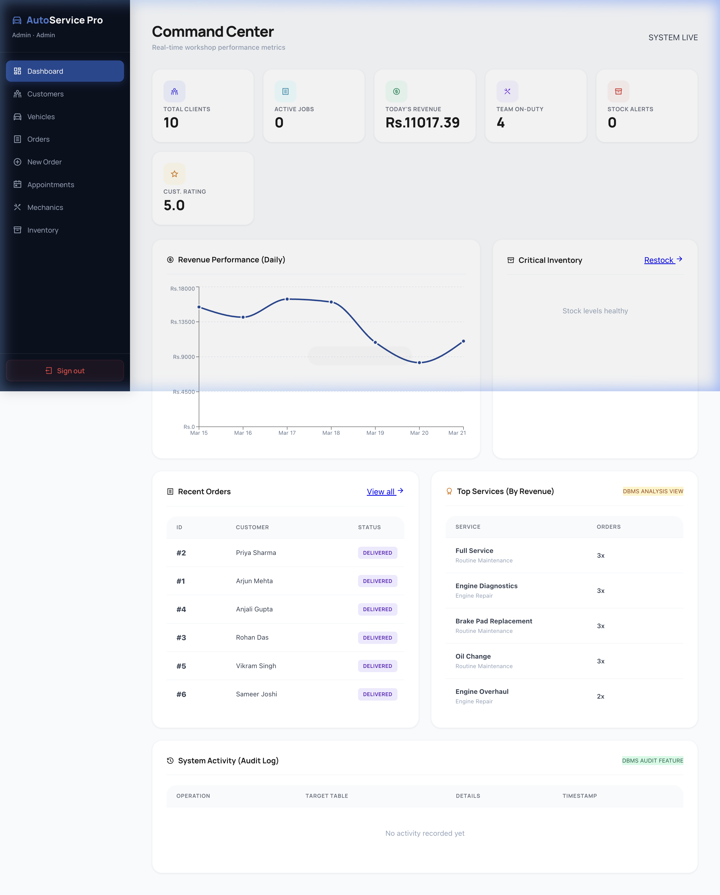
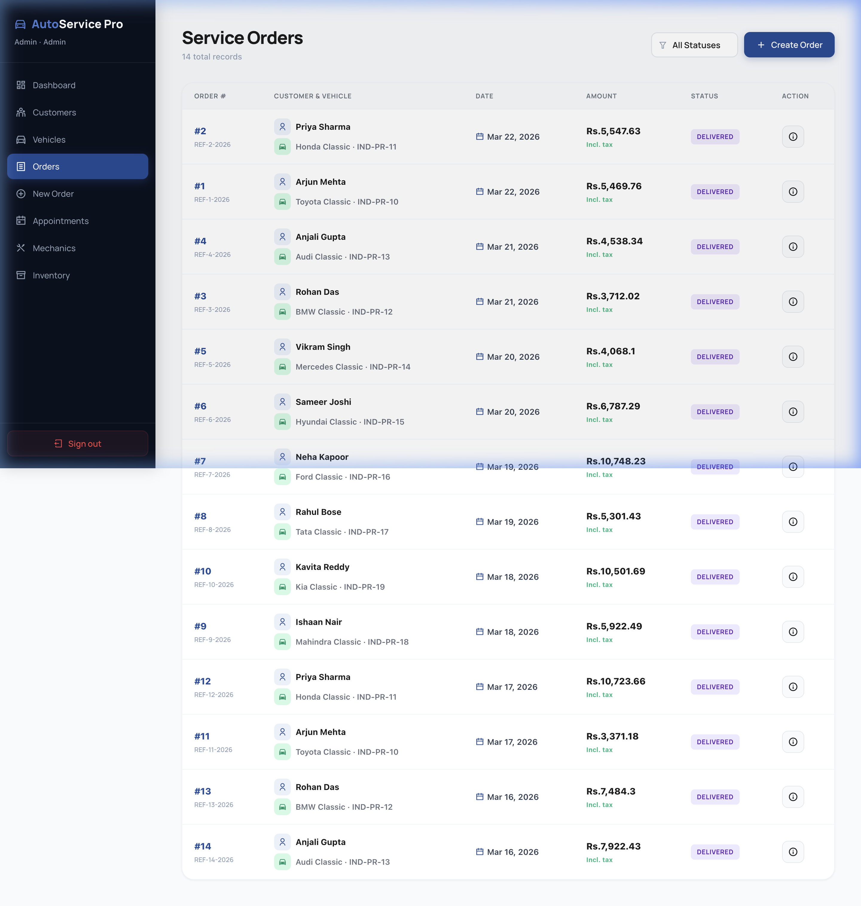
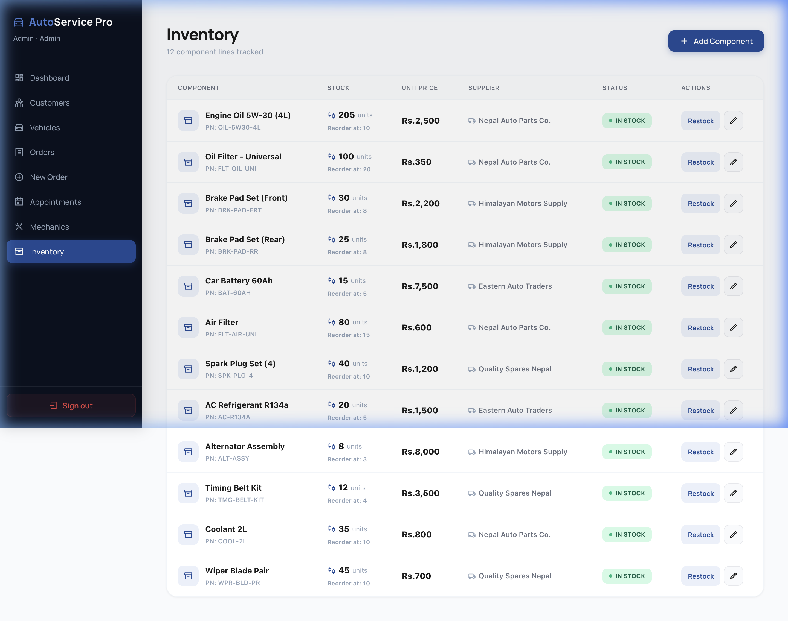
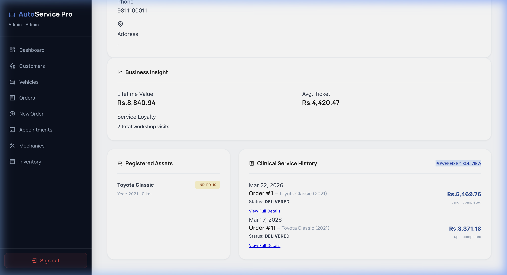

# 🏎️ Auto Service Pro: Advanced DBMS Workshop Management System

[](https://tidbcloud.com/)
[](https://nodejs.org/)
[](https://reactjs.org/)
[](https://frontend-pearl-eight-26.vercel.app/)

**Auto Service Pro** is a high-performance, enterprise-grade Workshop Management System designed to handle complex automotive service lifecycles. Built as a specialized **DBMS Project**, it demonstrates advanced database concepts including Transaction Management, Multi-table Joins, View Materialization, and Audit Logging.

---

## 🏛️ System Architecture

### 📊 Advanced DBMS Features Implemented:
*   **Transaction Management**: ACID-compliant service order creation involving multiple table updates (Orders, Line Items, Payments, Stock deduction).
*   **Logical Views**: 5 complex SQL views for real-time Business Intelligence (`vw_daily_revenue`, `vw_service_popularity`, `vw_inventory_status`).
*   **Audit Logging**: Automated system-wide logging of sensitive operations (Inserts, Updates, Deletions) for security and recovery.
*   **Relational Integrity**: Strict Foreign Key constraints and Cascading Deletes across 16+ relational tables.
*   **Composite Primary Keys**: Specialized weak entities (e.g., `service_line_items`) using composite keys for hierarchical data storage.

---

## 📸 Visual Showcase

### 🚀 Command Center (Dashboard)
Experience real-time analytics with custom views for Revenue, Stock Alerts, and Customer Ratings.


### 📋 Order Management
A strictly ordered, transactional view of all workshop jobs, linked directly to the `service_orders` and `payments` tables.


### 📦 Intelligent Inventory
Monitors `min_stock_level` via the `vw_inventory_status` view to trigger automated stock alerts.


### 👤 Customer Analytics
Detailed historical tracking of every service ever performed for a client, powered by the `vw_customer_service_history` master join.


---

## 🛠️ Tech Stack & Implementation

-   **Database**: TiDB Cloud (MySQL-Compatible Serverless SQL)
-   **Backend**: Node.js & Express with `mysql2/promise` for asynchronous IO.
-   **Frontend**: React.js with Vite, styled with modern Vanilla CSS for premium aesthetics.
-   **State Management**: React Hooks & Context for real-time UI updates.
-   **Charts**: Recharts for visualizing complex SQL revenue trends.

---

## 🚀 Installation & Local Setup

### 1. Database Setup
Ensure you have access to a TiDB or MySQL instance. Execute the scripts in `/database/` in the following order:
1. `01_schema.sql`
2. `02_initial_data.sql`
3. `03_views.sql`

### 2. Backend Setup
```bash
cd backend
npm install
node server.js
```

### 3. Frontend Setup
```bash
cd frontend
npm install
npm run dev
```

---

## 🎓 Academic Contribution
This project was developed as a comprehensive demonstration of **Database Management System (DBMS)** principles, focusing on the practical application of SQL optimization, relational modeling, and secure data handling in a modern web environment.

Developed with ❤️ for the DBMS Final Project.
